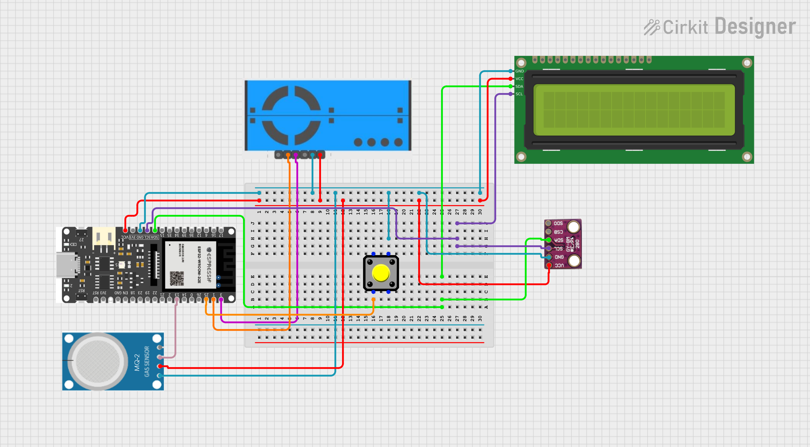

# IoT Indoor Air Quality Monitoring System
Link to the webapp: https://airqualitysystem.netlify.app/dashboard

If you want to run the use the Ai module, you have to build this docker from the root, and run it locally: docker-compose.yml 

## Overview
This project is a prototype IoT-based environmental monitoring system designed to measure air quality and atmospheric parameters indoors. The system provides real-time data on pollutants, temperature, pressure, and gas levels to help identify potential health and safety issues.

## Table of Contents
- [Introduction](#introduction)
- [Project Description](#project-description)
- [Hardware Architecture](#hardware-architecture)
- [System Architecture](#system-architecture)
- [Technologies & Design Principles](#technologies--design-principles)
- [Software Architecture](#software-architecture)
- [Conclusion](#conclusion)

## Introduction
**Purpose**: To develop an IoT-based system that helps monitor and improve indoor air quality for better human health.

**Problem Statement**: How can a prototype-based IoT system help monitor and improve air quality in indoor environments?

**Team & Roles**:
- **[@jonas-stack](https://github.com/jonas-stack)** – IoT, Backend (.NET), Frontend (React)
- **[@MadsFM](https://github.com/MadsFM)** – AI Module (Python + LLM)
- **[@based4real](https://github.com/based4real/based4real)** – IoT, Backend (.NET), Frontend (React)

## Project Description
The prototype integrates multiple sensors with an ESP32E microcontroller to:
- Measure PM2.5 (fine particles) with a PM25
- Measure pressure and temperature using BMP280
- Detect CO2 and other gases with MQ-2
- Display data on a 16x2 I2C LCD
- Transmit data to a server for storage and analysis

## Hardware Architecture
### Component List
- **16x2 I2C LCD**: Displays real-time data from sensors.
- **BME280**: Measures temperature and pressure, providing environmental context.
- **PM25 Sensor**: Measures fine dust particles, crucial for air quality.
- **MQ-2**: Detects CO2 and other gases, important for indoor air quality.
- **ESP32E**: The microcontroller that collects data from sensors and transmits it to the server.
- **Button**: Used to trigger wifi change.

### Wiring Summary
- LCD: VCC, GND, SDA, SCL → ESP32
- BME280: VCC, GND, SDA, SCL → ESP32
- PM25: VCC, GND, TX → GPIO1, RX → GPIO3
- MQ-2: VCC, GND, ANALOG → GPIO14
- Button: GND, GPIO → GPIO25

### Pinout
| Component    | ESP32 Pin |
|--------------|-----------|
| 16x2 I2C LCD | GPIO21 (SDA), GPIO22 (SCL) |
| BME280       | GPIO21 (SDA), GPIO22 (SCL) |
| PM25         | GPIO1 (TX), GPIO3 (RX)    |
| MQ-2         | GPIO14 (Analog)            |
| Button       | GPIO25 (Digital)           |

### Schematic

## System Architecture
### Data Flow
Sensor → ESP32E → HiveMQ (MQTT) → .NET Backend → PostgreSQL + WebSocket → React Frontend → AI Module

### Communication Protocols
- I2C: For LCD & BME280
- UART: For PM25
- GPIO: For MQ-2
- MQTT: ESP32 → Backend
- WebSocket: Backend → Frontend (real-time updates)
- REST API: Backend ↔ Frontend

## Technologies & Design Principles
### Technologies Used
- **ESP32E** – Microcontroller with Wi-Fi
- **React + TypeScript** – Frontend
- **.NET (C#)** – Backend with Onion Architecture
- **PostgreSQL** – Database
- **HiveMQ** – MQTT Broker
- **WebSocket** – Real-time communication
- **Python (Ollama)** – AI module for insights
- **Python (Gemma2:9b)** - AI module for data analysis
- **Netlify** – Frontend hosting
- **Fly.io** – Backend and database hosting
- 

### Design Principles
- Onion architecture for clean separation of concerns
- Scalable sensor integration
- Modular and extensible prototype

## Software Architecture

### Frontend (React + TypeScript)
- Real-time data from WebSocket
- Natural language recommendations from AI
- Hosted on Netlify https://www.netlify.com/

### Backend (.NET, C#)
- MQTT listener for incoming sensor data
- REST API for frontend
- WebSocket server for live updates
- AI data pipeline support
- Onion architecture for maintainability
- Hosted on Fly.io https://fly.io/

### Database (PostgreSQL)
- Stores data from sensors
- Stores devices status and history
- Hosted on Flyio https://fly.io/

### MQTT Broker (HiveMQ)
- Recieves sensor data from ESP32
- Sends data to the backend in json format
- Hosted on HiveMQ Cloud https://www.hivemq.com/

### AI Module (Python + LLM)
- Fetches data from PostgreSQL
- Analyzes patterns and generates natural-language advice

**Example outputs**:
- "Consider ventilating the room in the next 15 minutes."
- "PM2.5 particle levels are rising – maybe you should vacuum right now."
- "CO₂ levels have increased since yesterday."

## Conclusion
The prototype successfully demonstrates how IoT, cloud, and AI technologies can work together to create a smart air monitoring system. It is a functional proof of concept with:
- Real-time sensor data collection and visualization
- Reliable storage and communication using MQTT, WebSocket, and REST
- AI-generated health and environment recommendations

This system showcases the potential of IoT to contribute to healthier indoor environments by offering actionable insights in a user-friendly manner.

